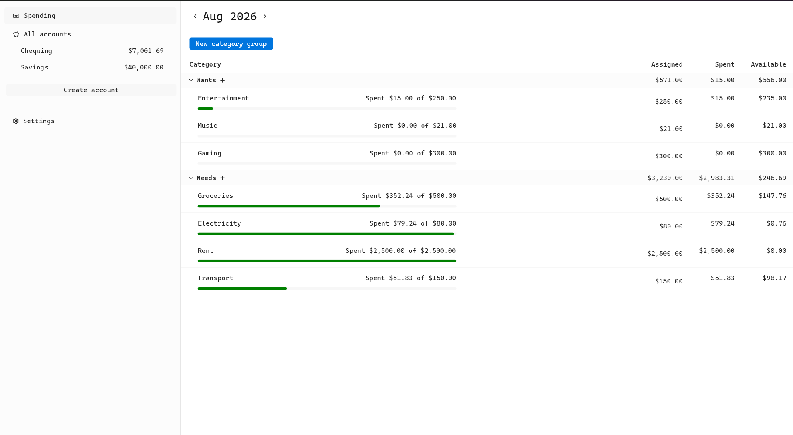

# Mukwa



Mukwa is a free and open source personal finance app. It is designed to be simple to use and get out of your way. Mukwa
is "local first", meaning all your sensitive financial data is stored locally on your device, no internet connections,
no data sent to the cloud.

This application is available on Windows and Linux. A macOS version is coming soon.

## Installation

Download the app via an installer:

- [Windows (EXE)](https://github.com/snubwoody/mukwa/releases/latest/download/Mukwa-x86_64-Setup.exe)
- [Linux (AppImage)](https://github.com/snubwoody/mukwa/releases/latest/download/Mukwa-x86_64.AppImage)

The app is also available on [Winget](https://winstall.app/apps/Wakunguma.Mukwa):

```powershell
winget install -e --id Wakunguma.Mukwa
```

## Contributing and Developing

If you have any ideas, issues, etc. regarding Mukwa, or would like to contribute to Mukwa through pull requests, please
check out our ["Contributing to Mukwa"](./CONTRIBUTING.md) document.

## License

Mukwa is licensed under the [GPL V3](https://www.gnu.org/licenses/gpl-3.0.en.html) license, see the [LICENSE](./LICENSE)
file for details.
